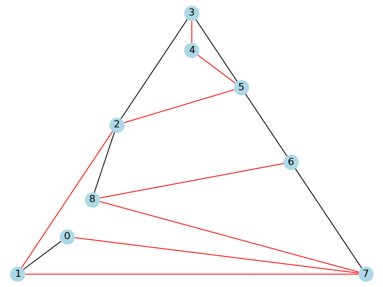
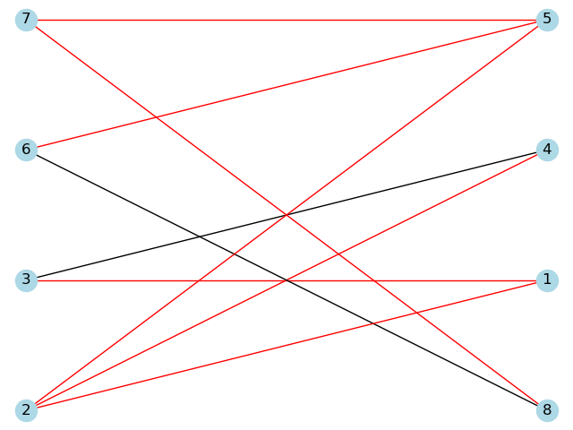
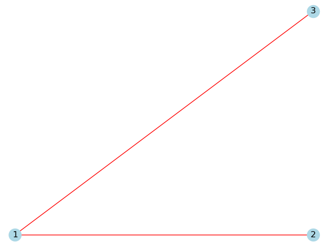
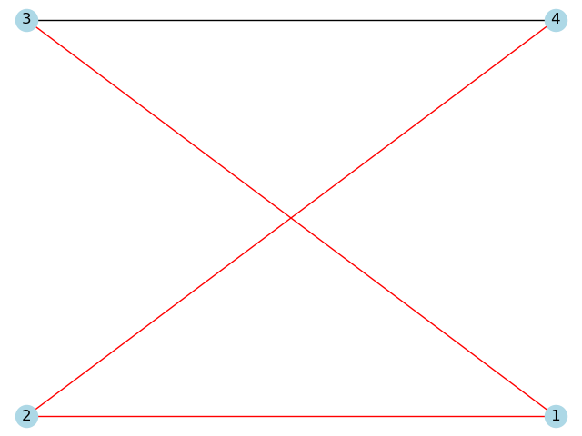
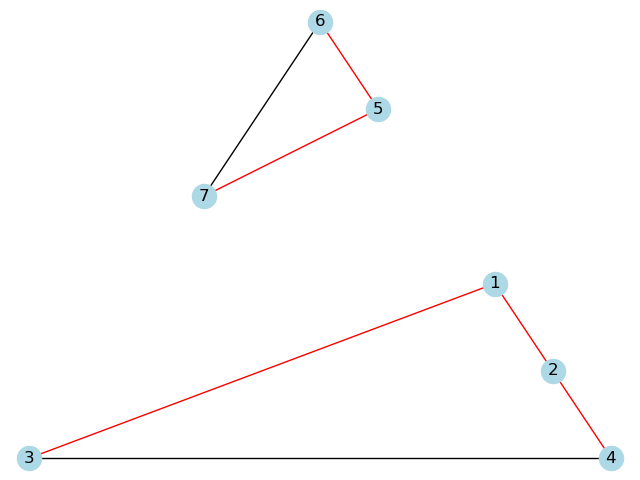
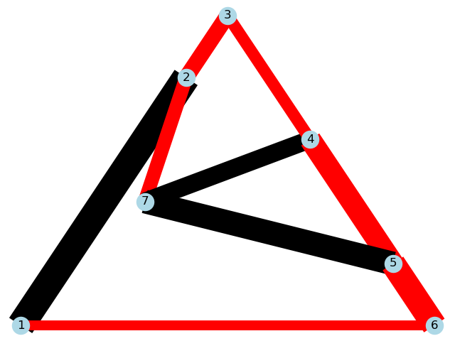
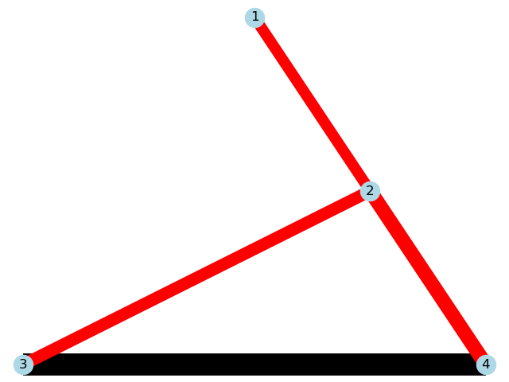
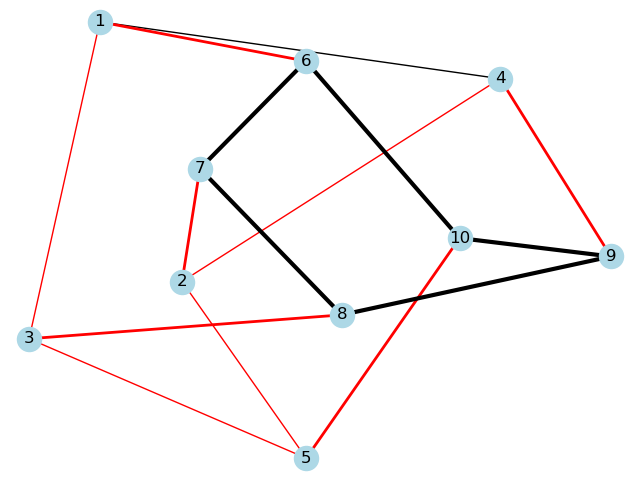

# Graphs implementation

Sample implementation of graph algorithms via Adjacency List via GraphAL and Adjacency Matrix via GraphAM

## Sample graphs:
These are internally drawn using networkx module

Petersen Graph is drawn with default NetworkX options (i.e., no effort was made to make it look prettier).